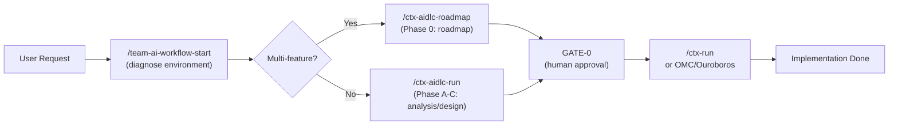

# aidlc-workflow

 

A systematic workflow for AI-driven requirements analysis, design, and validation. Ensures humans make critical decisions while leveraging AI's domain expertise.

> **TL;DR** — Just remember `/team-ai-workflow-start`. It diagnoses your environment and tells you what's next.

---

## Why You Need This

- **AI making business policy decisions unilaterally** — Payment, refund, permissions, notifications must always be approved by humans.
- **Auto-implementation without gates** — Building without validating requirements leads to poor outcomes.
- **No team standard** — Each project analyzing differently breaks consistency.

---

## What You Get

- **CTX-based context management** — Explicit rules, constraints, and reusable components per project
- **Human gates** — GATE-0~5 checkpoints where humans review and approve key decisions
- **Unit of Work decomposition** — Break requirements into S/M/L units for implementation sequencing
- **Multi-feature roadmaps** — Decompose large specs into features and auto-plan team allocation
- **OMC/Ouroboros integration** — Feed approved requirements to oh-my-claudecode autopilot/ralph or Ouroboros
- **Multi-account/multi-repo support** — Manage multiple Claude accounts and git repos simultaneously

---

## Quick Start

### Step 1: Clone Repository

```bash
git clone https://github.com/TaeseongYun/aidlc-workflow.git ~/workspace/aidlc-workflow
export TEAM_AI_WORKFLOW_DIR="$HOME/workspace/aidlc-workflow"
echo 'export TEAM_AI_WORKFLOW_DIR="$HOME/workspace/aidlc-workflow"' >> ~/.zshrc
```

### Step 2: Install Skills

```bash
bash ~/workspace/aidlc-workflow/scripts/install-skills.sh
```

**For multiple Claude accounts:**

```bash
CLAUDE_HOME="$HOME/.claude-personal" CODEX_HOME="$HOME/.codex-personal" \
  bash ~/workspace/aidlc-workflow/scripts/install-skills.sh
```

### Step 3: Initialize Project

```bash
cd my-project
bash ~/workspace/aidlc-workflow/scripts/init-project.sh
```

Now run `/team-ai-workflow-start`.

---

## Workflow Overview



---

## Core Concepts

**CTX**: Project-local facts (tech stack, constraints, reusable components). All analysis is grounded in CTX.

**aidlc-docs**: Permanent record of requirements, questions, design, and work units per feature.

**Gates (GATE-0~5)**: Human checkpoints at key decision points. Automation cannot bypass these.

**Unit of Work**: Breaking requirements into S/M/L units for implementation sequencing and parallelization.

Learn more in [docs/concepts.md](docs/concepts.md).

---

## Skills

| Skill | Purpose |
|-------|---------|
| `/team-ai-workflow-start` | Entry point. Diagnose + route to next step |
| `/ctx-aidlc-roadmap` | Phase 0: Multi-feature roadmap decomposition |
| `/ctx-aidlc-run` | Phase A-C: Requirements analysis, design, artifacts |
| `/ctx-run` | Implementation: Write code based on approved requirements |
| `/ctx-architect-judge` | Determine domain scope and CTX references |
| `/ctx-domain-exec` | Identify affected domains |
| `/ctx-reviewer` | Validate CTX compliance |
| `/ctx-updater` | Update code/docs |
| `/ctx-refiner` | Optimize CTX docs |
| `/ctx-commit-planner` | Design commit structure |

---

## OMC / Ouroboros Integration

team-ai-workflow decides **what to build**. OMC and Ouroboros handle **how to automate the building**.

| Mode | Use When | Pipeline |
|------|----------|----------|
| **OMC autopilot** | Full automation | `/ctx-aidlc-run` → GATE → `/oh-my-claudecode:autopilot` |
| **OMC ralph** | Single feature loop | `/ctx-aidlc-run` → `/oh-my-claudecode:ralph` |
| **OMC team** | Multi-feature parallel | `/ctx-aidlc-roadmap` → GATE-0 → `/oh-my-claudecode:team` |
| **Ouroboros evolve** | Evolutionary iteration | `/ctx-aidlc-run` → `ouroboros_evolve_step` |

Details: [docs/omc-ouroboros-integration.md](docs/omc-ouroboros-integration.md)

---

## Multi-Account Setup

```bash
# Install for secondary account
CLAUDE_HOME="$HOME/.claude-personal" bash ~/workspace/aidlc-workflow/scripts/install-skills.sh

# Initialize each project once
cd other-project
bash ~/workspace/aidlc-workflow/scripts/init-project.sh
```

---

## Directory Structure

```text
aidlc-workflow/
├── core/                       # Core analysis logic
├── common/                     # Shared rules
├── extensions/                 # Optional rule packs
├── skills/                     # Skill source (deployed by install-skills.sh)
├── tools/                      # Validation tools
├── scripts/                    # Install & init
├── templates/                  # Document templates
├── docs/                       # Detailed guides
└── examples/                   # Reference implementations
```

---

## Contributing

Issues and PRs welcome. Edit under `skills/`, then run `bash scripts/install-skills.sh`. Use English for commit messages and PR titles.

See [CONTRIBUTING.md](CONTRIBUTING.md) for details.

---

## License

MIT. See [LICENSE](LICENSE).

---

## More

- [Quickstart](QUICKSTART.md) — Setup and basic usage
- [Workflow Guide](docs/workflow-guide.md) — Phase-by-phase execution
- [Concepts](docs/concepts.md) — CTX, gates, units of work
- [OMC/Ouroboros](docs/omc-ouroboros-integration.md) — Automation layer
- [FAQ](docs/faq.md) — Common questions
