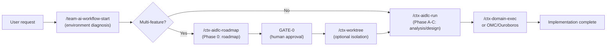

# aidlc-workflow

 

[English](README.md) · **한국어** · [中文](README.zh.md)

AI 요구사항 분석·설계·검증을 체계적으로 수행하기 위한 팀 공용 워크플로우. 중요한 결정은 인간이 내리고, AI는 도메인 지식을 최대한 활용하도록 보장한다.

> **TL;DR** — `/team-ai-workflow-start` 하나만 기억하면 된다. 환경을 진단하고 다음 단계를 알려준다.

---

## 왜 필요한가

- **AI가 자체적으로 비즈니스 정책을 결정하는 문제** — 결제·환불·권한·알림 정책은 반드시 인간이 승인해야 한다.
- **게이트 없는 자동 구현의 위험** — 요구사항을 제대로 확인하지 않고 구현하면 품질이 낮아진다.
- **팀 표준의 부재** — 프로젝트마다 다른 기준으로 분석하면 일관성이 무너진다.

---

## 제공하는 것

- **CTX 기반 컨텍스트 관리** — 프로젝트별 규칙·금지사항·재사용 컴포넌트를 명시적으로 정의
- **인간 게이트** — GATE-0부터 5까지, 주요 결정 단계마다 인간이 검토하고 승인
- **Unit of Work 분해** — 요구사항을 크기(S/M/L)별로 분해하고 구현 순서 및 병렬화 계획 수립
- **멀티 피처 로드맵** — 큰 계획을 피처로 분해하고 팀 분업을 자동으로 계획
- **OMC/Ouroboros 연동** — 승인된 요구사항을 oh-my-claudecode autopilot/ralph 또는 Ouroboros evolve에 연결
- **멀티 계정/멀티 레포 지원** — 여러 Claude 계정과 git 레포를 동시에 관리

---

## 빠른 시작

### Step 1: 저장소 클론

```bash
git clone https://github.com/TaeseongYun/aidlc-workflow.git ~/workspace/aidlc-workflow
export TEAM_AI_WORKFLOW_DIR="$HOME/workspace/aidlc-workflow"
echo 'export TEAM_AI_WORKFLOW_DIR="$HOME/workspace/aidlc-workflow"' >> ~/.zshrc
```

### Step 2: 스킬 설치

```bash
bash ~/workspace/aidlc-workflow/scripts/install-skills.sh
```

**여러 Claude 계정을 사용하는 경우:**

```bash
CLAUDE_HOME="$HOME/.claude-personal" CODEX_HOME="$HOME/.codex-personal" \
  bash ~/workspace/aidlc-workflow/scripts/install-skills.sh
```

### Step 3: 프로젝트 초기화

```bash
cd my-project
bash ~/workspace/aidlc-workflow/scripts/init-project.sh
```

이제 `/team-ai-workflow-start`를 실행할 수 있다.

---

## 워크플로우 한눈에 보기



---

## 핵심 개념

### CTX: 프로젝트 로컬 사실

`ctx/` 디렉토리에 프로젝트의 기존 구조·기술 스택·금지사항·재사용 컴포넌트를 정의한다. 모든 분석과 설계는 CTX를 기반으로 한다.

```
ctx/
├── INDEX.md                    # Project metadata
└── project-profile.ctx.md      # Tech stack, architecture, prohibition rules
```

### aidlc-docs: 피처별 산출물

각 피처의 요구사항·질문·Units of Work·기술 설계는 `aidlc-docs/features/<feature-name>/` 아래에 저장된다. 산출물은 영구 기록으로 남는다.

### GATE: 인간 승인 체크포인트

- **GATE-0**: 멀티 피처 로드맵 승인
- **GATE-1**: 초기 요구사항 명확화 승인
- **GATE-2, 3**: 최종 요구사항 및 설계 승인
- **GATE-4**: 인프라 설계 승인 (조건부)
- **GATE-5**: 구현 준비 완료 확인
- 조건부 하프 게이트 **2.5 / 2.7 / 3.5**는 트리거 조건(페르소나, 컴포넌트, M/L 기술 설계)이 해당될 때만 발동한다 — 전체 목록은 [common/stage-gate-rules.md](common/stage-gate-rules.md) 참고

### Unit of Work: 구현의 단위

요구사항을 S/M/L 크기의 작업 단위로 분해한다. 각 UOW는 인수 조건(Acceptance Criteria)과 검증 방법을 명시한다.

### Platform Guidance: 플랫폼별 아키텍처 베이스라인

`platforms/<platform>/guidance.md` (android, ios, backend, frontend, flutter, rn, kmp)는 해당 플랫폼에서 설계(`/ctx-aidlc-run` STEP 6.5) 또는 구현(`/ctx-domain-exec`) 전에 에이전트가 로드해야 할 아키텍처 베이스라인을 담고 있다. 플랫폼은 `ctx/project-profile.ctx.md`에 선언하며, 우선순위는 프로젝트 `ctx/` > platform guidance > 일반 지식 순이다. 각 플랫폼에는 figma-to-code, vibe-coding security guard, testing, design-system, accessibility, i18n, observability, contract-codegen 등 상세한 플랫폼별 스킬이 함께 제공된다. 플랫폼 스킬은 **옵트인(opt-in)** 방식이다: `bash scripts/install-skills.sh --platforms=android,ios` (또는 `--platforms=all`)로 자신의 스택에 맞는 스킬만 설치한다. 문서는 독립적인 마크다운 형식이므로 외부 레포에서도 설치 경로 또는 raw GitHub URL로 사용할 수 있다 — [platforms/README.md](platforms/README.md) 참고.

개념에 대한 자세한 설명은 [docs/concepts.md](docs/concepts.md)를 참고하라.

---

## 스킬 목록

| 스킬 | 목적 |
|------|------|
| `/team-ai-workflow-start` | 진입점. 환경 진단 + 후속 스킬로 라우팅 |
| `/ctx-aidlc-roadmap` | Phase 0: 멀티 피처 로드맵 분해 (GATE-0) |
| `/ctx-worktree` | 승인된 병렬 안전 피처를 격리된 git worktree에 할당 |
| `/ctx-aidlc-run` | Phase A-C: 요구사항 분석, 설계, 산출물 생성 |
| `/ctx-architect-judge` | 도메인 범위 및 CTX 참조 결정 |
| `/ctx-domain-exec` | 영향받는 도메인 식별 |
| `/ctx-reviewer` | CTX 위반 여부 검증 |
| `/ctx-updater` | 코드/문서 업데이트 |
| `/ctx-refiner` | CTX 문서 최적화 |
| `/ctx-commit-planner` | 커밋 구조 설계 |
| `/ctx-score-loop` | 구현 후 의존성 + 4개 축에 대한 자동 반복 채점 (85점 초과 시 완료) |
| `/ctx-hallucination-audit` | Hallucination Guard 감사 루프. graphify(codegraph 폴백)로 개발 사실을 검증하고, 반박된 주장을 격리한 뒤 점수가 87 이상이 될 때까지 반복 |
| `/ctx-aidlc-sync` | AWS AI-DLC 업스트림 변경을 이 워크플로우 레포에 이식 (동기화 점수 90점 초과 시에만 PR) |
| `/mobile-webview-bridge` | 하나의 공유 contract-first 프로토콜로 Android/iOS/KMP/RN/Flutter를 지원하는 JS ↔ 네이티브 WebView 브리지 (generator + guard 모드) |

> **Hallucination Guard (항상 활성).** 경로·심볼·API·설정 키·버전 등 개발
> 사실을 코드 그래프와 대조 검증하여 AI의 추측이 사실로 누출되지 않도록 한다.
> `graphify` (`graphifyy[mcp]`)는 초기 설정에 **강력히 권장**되지만 필수는 아니다 (codegraph는 선택적 폴백).
> `graphify`가 없으면 `/team-ai-workflow-start`가 설치 / degraded 모드로 진행 / 취소를
> 대화로 묻는다. degraded 모드에서는 VERIFY가 grep/Read로 후퇴한다. 규칙: `extensions/hallucination-guard/`; 가이드:
> `docs/hallucination-guard.md`.

---

## OMC / Ouroboros 연동

team-ai-workflow는 "**무엇을 만들지**"를 결정한다. oh-my-claudecode (OMC)와 Ouroboros는 "**어떻게 자동으로 구현할지**"를 담당한다.

### 연동 패턴

| 모드 | 사용 시점 | 파이프라인 |
|------|---------|----------|
| **OMC autopilot** | 전체 구현 자동화 | `/ctx-aidlc-run` → GATE 승인 → `/oh-my-claudecode:autopilot` |
| **OMC ralph** | 소규모 피처의 완성 루프 | `/ctx-aidlc-run` → `/oh-my-claudecode:ralph` |
| **OMC team** | 다수 피처 병렬 처리 | `/ctx-aidlc-roadmap` → GATE-0 → `/oh-my-claudecode:team` |
| **Ouroboros evolve** | 진화적 반복 설계/구현 | `/ctx-aidlc-run` → `ouroboros_evolve_step` |

상세 패턴 및 설정은 [docs/omc-ouroboros-integration.md](docs/omc-ouroboros-integration.md)를 참고하라.

### 절제 레이어 — ponytail 연동

team-ai-workflow가 "**무엇을**", OMC/Ouroboros가 "**어떻게, 자동으로**"를 담당한다면,
[ponytail](https://github.com/DietrichGebert/ponytail)은 "**얼마나 적게**"를 담당한다.
구현 직전(`/ctx-domain-exec`)에 7단계 절제 사다리를 적용하여 과도한 엔지니어링을 방지한다.
플러그인을 설치하지 않아도 [core/lazy-implementation.md](core/lazy-implementation.md) 규칙만으로 동작하며,
검증·보안·AC·정책 등 안전 가드는 절대 제거하지 않는다.

연동 방법: [docs/ponytail-integration.md](docs/ponytail-integration.md)

---

## 다른 계정/레포에서 사용하기

여러 Claude 계정 또는 다른 git 레포에 동일한 워크플로우를 설치하려면:

```bash
# 개인 계정에 추가 설치
CLAUDE_HOME="$HOME/.claude-personal" bash ~/workspace/aidlc-workflow/scripts/install-skills.sh

# 업무 계정에 추가 설치
CLAUDE_HOME="$HOME/.claude-work" bash ~/workspace/aidlc-workflow/scripts/install-skills.sh
```

각 프로젝트는 한 번만 초기화하면 된다:

```bash
cd other-project
bash ~/workspace/aidlc-workflow/scripts/init-project.sh
```

멀티 계정 상세 설정: [docs/omc-ouroboros-integration.md](docs/omc-ouroboros-integration.md)

---

## 디렉토리 구조

```text
aidlc-workflow/
├── core/                       # Common analysis logic (input validation, units generation)
├── common/                     # Common rules (question governance, depth levels, gates, recovery)
├── extensions/                 # Rule packs
│   ├── performance|security|api-contract/   # Optional (opt-in)
│   └── hallucination-guard/    # Always on: guard rules + Linear routing
├── platforms/                  # Per-platform guidance + skills (android, ios, backend, frontend, flutter, rn, kmp)
├── skills/                     # Skill sources (deployed by install-skills.sh)
│   ├── team-ai-workflow-start/
│   ├── ctx-aidlc-roadmap/
│   ├── ctx-worktree/
│   ├── ctx-aidlc-run/
│   ├── ctx-score-loop/
│   ├── ctx-hallucination-audit/
│   └── ... (12 skills)
├── tools/                      # Validation tools (evaluator, skill-validator)
├── scripts/                    # Installation and initialization
│   ├── install-skills.sh       # Global skill installation
│   ├── init-project.sh         # Create per-project ctx/, aidlc-docs/ and check code graph prerequisites
│   ├── check-graphify.sh       # graphify + graph.json prerequisite gate (codegraph fallback)
│   └── harvest-assumptions.sh  # Collect uncertainty markers for the audit loop
├── templates/                  # Document templates
├── docs/                       # Detailed guides
│   ├── concepts.md             # CTX, aidlc-docs, GATE concepts
│   ├── workflow-guide.md       # Per-phase execution guide
│   ├── omc-ouroboros-integration.md
│   ├── brownfield-guide.md
│   ├── faq.md
│   └── changelog/              # Per-version change history
├── examples/                   # References (golden baselines, multi-feature coordination)
├── QUICKSTART.md               # Korean quick start
└── README.md                   # This file
```

---

## 산출물 구조

각 피처의 작업 산출물은 다음 구조로 정리된다:

```text
aidlc-docs/
├── aidlc-state.md             # Project/roadmap state
├── audit.md                   # Audit trail
├── _roadmap.md                # Multi-feature roadmap (optional)
└── features/<feature-slug>/
    ├── status.md              # Feature card + Readiness Score
    ├── requirements.md        # Final requirements
    ├── requirement-verification-questions.md  # Open questions
    ├── unit-of-work.md        # UOW decomposition (S/M/L)
    ├── technical-design.md    # Technical design (M/L only)
    └── infrastructure-design.md (conditional)
```

---

## 기여하기

이 워크플로우는 모든 프로젝트가 공유하는 표준이다. 개선 사항을 제안해 주길 바란다.

### 기여 방법

1. **이슈 제출**: 기능 요청이나 버그 보고는 GitHub Issues 사용
2. **PR 제출**: 문서 또는 스킬 개선은 Pull Request 사용
3. **변경 방법**:
   - `skills/` 디렉토리 내에서만 편집
   - 편집 후 `bash scripts/install-skills.sh` 실행
   - 커밋 메시지는 영어 사용

상세 기여 가이드는 [CONTRIBUTING.md](CONTRIBUTING.md)를 참고하라.

---

## 변경 이력

릴리스별 상세 변경사항: [docs/changelog/](docs/changelog/)

주요 업데이트:
- **2026-09-14**: `mobile-webview-bridge` 스킬 — 하나의 공유 contract-first 프로토콜(envelope, handshake, 보안, 스레딩, 라이프사이클)로 Android/iOS/KMP/RN/Flutter를 지원하는 JS ↔ 네이티브 WebView 브리지. 플랫폼별 레퍼런스 바인딩, generator/guard 모드, 오프라인 envelope 검증기 포함 ([상세](docs/changelog/2026-09-14-mobile-webview-bridge-skill.md))
- **2026-09-06**: 실행 결과 로거 — `scripts/run-logger.ts`가 타입이 지정된 결과를 `aidlc-docs/run-log.ndjson`과 graphify가 수집 가능한 `run-log.md` 미러에 기록하여, 과거 결과를 `graphify query`(degraded 모드에서는 로컬 `recall`)로 조회할 수 있게 함. score-loop, hallucination-audit, aidlc-run, 세션 진입에 연결 ([상세](docs/changelog/2026-09-06-run-logger-and-graphify-rag.md))
- **2026-09-03**: `graphify`를 소프트 의존성으로 전환 — 도구가 없어도 설정을 차단하지 않고 grep/Read 검증으로 degrade. CI(`validate-skills.sh` + golden baselines) 추가, `validate-questions.sh`가 영어 필드 라벨을 허용하도록 수정 ([상세](docs/changelog/2026-09-03-graphify-soft-dependency-and-ci.md))
- **2026-08-27**: KMP (Kotlin Multiplatform)를 7번째 플랫폼으로 추가 — guidance + 13개 스킬 (figma-to-kmp, vibe-coding security guard, testing 등)
- **2026-08-26**: 전 플랫폼 대상 플랫폼별 스킬 패밀리 (testing, design-system, accessibility, contract-codegen, observability, i18n)
- **2026-04-29**: Phase 0 Roadmapping 스킬 추가, 멀티 피처 협업 워크플로우 공식화
- **2026-04-22**: 과신 방지, 강화된 검증, 평가 프레임워크
- **2026-04-14**: Lazy Loading + 세션 분리를 기본 모델로 채택, 토큰 절감

---

## 라이선스

MIT License. 자세한 내용은 [LICENSE](LICENSE) 참고.

---

## 더 알아보기

- [Quick Start Guide](QUICKSTART.md) — 단계별 설치 및 기본 사용법
- [Workflow Guide](docs/workflow-guide.md) — 단계별 상세 실행 절차
- [Core Concepts](docs/concepts.md) — CTX, aidlc-docs, 게이트, Unit of Work
- [OMC/Ouroboros Integration](docs/omc-ouroboros-integration.md) — 자동화 레이어 연결
- [Ponytail Integration](docs/ponytail-integration.md) — 코드 절제 레이어 연결
- [Brownfield Guide](docs/brownfield-guide.md) — 기존 시스템 분석
- [FAQ](docs/faq.md) — 자주 묻는 질문 및 체크리스트
