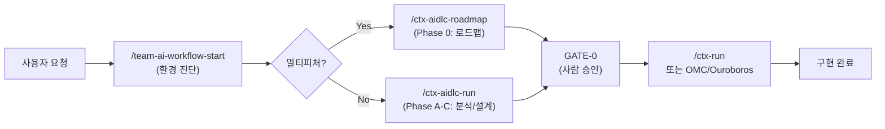

# aidlc-workflow

 

**[README in English](README.en.md)**

AI 요구사항 분석, 설계, 검증을 체계적으로 진행하는 팀 공통 워크플로우입니다. 사람이 중요한 결정을 내리도록 보장하면서도 AI가 도메인 지식을 최대한 활용하게 합니다.

> **TL;DR** — `/team-ai-workflow-start` 한 번만 외우면 됩니다. 환경을 진단하고 다음 단계를 알려줍니다.

---

## 왜 필요한가

- **AI가 비즈니스 정책을 맘대로 결정하는 문제** — 결제, 환불, 권한, 알림 정책은 항상 사람이 승인해야 합니다.
- **게이트 없는 자동 구현의 위험** — 요구사항을 제대로 확인하지 않고 구현하면 완성도가 떨어집니다.
- **팀 표준 부재** — 각 프로젝트가 다른 기준으로 분석하면 일관성이 깨집니다.

---

## 무엇을 주는가

- **CTX 기반 컨텍스트 관리** — 프로젝트별 룰, 금지사항, 재사용 컴포넌트를 명시적으로 정의
- **사람 게이트** — GATE-0~5로 주요 결정 단계에서 사람이 검토하고 승인
- **Unit of Work 분해** — 요구사항을 크기별(S/M/L)로 분해해 구현 순서와 병렬화 계획
- **멀티피처 로드맵** — 큰 기획서를 피처별로 분해하고 팀 분업 자동 계획
- **OMC/Ouroboros 연동** — 승인된 요구사항을 oh-my-claudecode autopilot/ralph나 Ouroboros evolve로 연결
- **멀티계정/멀티레포 지원** — 여러 Claude 계정과 깃 레포를 동시에 관리

---

## 빠른 시작

### 1단계: 저장소 클론

```bash
git clone https://github.com/TaeseongYun/aidlc-workflow.git ~/workspace/aidlc-workflow
export TEAM_AI_WORKFLOW_DIR="$HOME/workspace/aidlc-workflow"
echo 'export TEAM_AI_WORKFLOW_DIR="$HOME/workspace/aidlc-workflow"' >> ~/.zshrc
```

### 2단계: 스킬 설치

```bash
bash ~/workspace/aidlc-workflow/scripts/install-skills.sh
```

**여러 Claude 계정을 사용하는 경우:**

```bash
CLAUDE_HOME="$HOME/.claude-personal" CODEX_HOME="$HOME/.codex-personal" \
  bash ~/workspace/aidlc-workflow/scripts/install-skills.sh
```

### 3단계: 프로젝트 초기화

```bash
cd my-project
bash ~/workspace/aidlc-workflow/scripts/init-project.sh
```

이제 `/team-ai-workflow-start`를 실행할 수 있습니다.

---

## 워크플로우 한눈에



---

## 핵심 개념

### CTX: 프로젝트 로컬 사실

`ctx/` 디렉토리에 프로젝트의 기존 구조, 기술 스택, 금지사항, 재사용 컴포넌트를 정의합니다. 모든 분석과 설계는 CTX를 근거로 합니다.

```
ctx/
├── INDEX.md                    # 프로젝트 메타데이터
└── project-profile.ctx.md      # 기술 스택, 아키텍처, 금지 규칙
```

### aidlc-docs: 기능별 산출물

각 기능의 요구사항, 질문, Unit of Work, 기술 설계를 `aidlc-docs/features/<기능명>/` 아래에 저장합니다. 산출물은 영구 기록으로 남습니다.

### 게이트(GATE): 사람 승인 체크포인트

- **GATE-0**: 멀티피처 로드맵 승인
- **GATE-1**: 초기 요구사항 명확화 승인
- **GATE-2, 3**: 최종 요구사항 및 설계 승인
- **GATE-5**: 구현 준비 완료 확인

### Unit of Work: 구현 단위

요구사항을 S/M/L 크기의 작업 단위로 분해합니다. 각 UOW는 Acceptance Criteria와 검증 방법을 명시합니다.

자세한 개념 설명은 [docs/concepts.md](docs/concepts.md)를 참조하세요.

---

## 스킬 목록

| 스킬 | 용도 |
|------|------|
| `/team-ai-workflow-start` | 진입점. 환경 진단 + 후속 스킬 라우팅 |
| `/ctx-aidlc-roadmap` | Phase 0: 멀티피처 로드맵 분해 (GATE-0) |
| `/ctx-aidlc-run` | Phase A-C: 요구사항 분석, 설계, 산출물 생성 |
| `/ctx-run` | 구현: 승인된 요구사항 기준으로 코드 작성 |
| `/ctx-architect-judge` | 도메인 범위와 CTX 참조 판단 |
| `/ctx-domain-exec` | 영향받는 도메인 식별 |
| `/ctx-reviewer` | CTX 위반 여부 검증 |
| `/ctx-updater` | 코드/문서 갱신 |
| `/ctx-refiner` | CTX 문서 최적화 |
| `/ctx-commit-planner` | 커밋 구조 설계 |

---

## OMC / Ouroboros 연동

team-ai-workflow은 "**무엇을 만들 것인가**"를 결정합니다. oh-my-claudecode(OMC)와 Ouroboros는 "**어떻게 자동으로 구현할 것인가**"를 담당합니다.

### 연동 패턴

| 모드 | 사용 시기 | 파이프라인 |
|------|---------|----------|
| **OMC autopilot** | 전체 구현 자동화 | `/ctx-aidlc-run` → GATE 승인 → `/oh-my-claudecode:autopilot` |
| **OMC ralph** | 작은 기능 완성 루프 | `/ctx-aidlc-run` → `/oh-my-claudecode:ralph` |
| **OMC team** | 멀티피처 병렬 처리 | `/ctx-aidlc-roadmap` → GATE-0 → `/oh-my-claudecode:team` |
| **Ouroboros evolve** | 진화적 반복 설계/구현 | `/ctx-aidlc-run` → `ouroboros_evolve_step` |

자세한 패턴과 설정은 [docs/omc-ouroboros-integration.md](docs/omc-ouroboros-integration.md)를 참조하세요.

---

## 다른 계정/레포에서 쓰기

동일한 workflow를 여러 Claude 계정 또는 다른 깃 레포에 설치하려면:

```bash
# 개인 계정에 추가 설치
CLAUDE_HOME="$HOME/.claude-personal" bash ~/workspace/aidlc-workflow/scripts/install-skills.sh

# 일 계정에 추가 설치
CLAUDE_HOME="$HOME/.claude-work" bash ~/workspace/aidlc-workflow/scripts/install-skills.sh
```

각 프로젝트마다 한 번만 초기화하면 됩니다:

```bash
cd other-project
bash ~/workspace/aidlc-workflow/scripts/init-project.sh
```

multi-account 상세 설정: [docs/omc-ouroboros-integration.md#5-멀티계정-멀티레포-셋업](docs/omc-ouroboros-integration.md)

---

## 디렉토리 구조

```text
aidlc-workflow/
├── core/                       # 공통 분석 로직 (input validation, units generation)
├── common/                     # 공통 규칙 (question governance, depth levels, gates, recovery)
├── extensions/                 # 선택적 규칙 팩 (performance, security, api-contract)
├── skills/                     # 스킬 원본 (install-skills.sh가 배포)
│   ├── team-ai-workflow-start/
│   ├── ctx-aidlc-roadmap/
│   ├── ctx-aidlc-run/
│   ├── ctx-run/
│   └── ... (7개 스킬)
├── tools/                      # 검증 도구 (evaluator, skill-validator)
├── scripts/                    # 설치 및 초기화
│   ├── install-skills.sh       # 스킬 전역 설치
│   └── init-project.sh         # 프로젝트별 ctx/, aidlc-docs/ 생성
├── templates/                  # 문서 템플릿
├── docs/                       # 상세 가이드
│   ├── concepts.md             # CTX, aidlc-docs, GATE 개념
│   ├── workflow-guide.md       # Phase별 실행 가이드
│   ├── omc-ouroboros-integration.md
│   ├── brownfield-guide.md
│   ├── faq.md
│   └── changelog/              # 버전별 변경 이력
├── examples/                   # 레퍼런스 (golden baselines, multi-feature coordination)
├── QUICKSTART.md               # 한국어 빠른 시작
└── README.md                   # 이 파일
```

---

## 산출물 구조

각 기능별 작업 산출물은 다음 구조로 정리됩니다:

```text
aidlc-docs/
├── aidlc-state.md             # 프로젝트/로드맵 상태
├── audit.md                   # 감사 추적
├── _roadmap.md                # 멀티피처 로드맵 (선택)
└── features/<feature-slug>/
    ├── status.md              # 기능 카드 + Readiness Score
    ├── requirements.md        # 최종 요구사항
    ├── requirement-verification-questions.md  # 미결 질문
    ├── unit-of-work.md        # UOW 분해 (S/M/L)
    ├── technical-design.md    # 기술 설계 (M/L만)
    └── infrastructure-design.md (조건부)
```

---

## Contributing

이 워크플로우는 모든 프로젝트가 공유하는 기준입니다. 개선 사항을 제안해주세요.

### 기여 방법

1. **이슈 제출**: 기능 요청이나 버그 리포트는 GitHub Issues 사용
2. **PR 제출**: 문서나 스킬 개선 시 Pull Request
3. **수정 방법**:
   - `skills/` 디렉토리에서만 수정
   - 수정 후 `bash scripts/install-skills.sh` 실행
   - 커밋 메시지는 영어 사용

자세한 기여 가이드는 [CONTRIBUTING.md](CONTRIBUTING.md)를 참조하세요.

---

## 변경 이력

릴리스별 상세 변경 사항: [docs/changelog/](docs/changelog/)

주요 업데이트:
- **2026-04-29**: Phase 0 Roadmapping 스킬 신설, 멀티피처 협업 워크플로우 정식화
- **2026-04-22**: 과신 방지, 검증 강화, 평가 프레임워크
- **2026-04-14**: Lazy Loading + 세션 분리 기본 모델, 토큰 다이어트

---

## 라이선스

MIT License. 자세한 내용은 [LICENSE](LICENSE)를 참조하세요.

---

## 더 알아보기

- [빠른 시작 가이드](QUICKSTART.md) — 단계별 설치 및 기본 사용법
- [워크플로우 가이드](docs/workflow-guide.md) — Phase별 상세 실행 절차
- [핵심 개념](docs/concepts.md) — CTX, aidlc-docs, 게이트, Unit of Work
- [OMC/Ouroboros 연동](docs/omc-ouroboros-integration.md) — 자동화 레이어 연결
- [Brownfield 가이드](docs/brownfield-guide.md) — 기존 시스템 분석
- [FAQ](docs/faq.md) — 자주 하는 질문과 체크리스트
