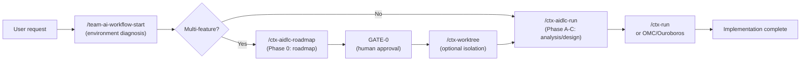

# aidlc-workflow

 

**[README in English](README.en.md)**

A team-wide workflow for systematically carrying out AI requirements analysis, design, and verification. It ensures that humans make the important decisions while letting AI make the most of its domain knowledge.

> **TL;DR** — you only need to memorize `/team-ai-workflow-start`. It diagnoses your environment and tells you the next step.

---

## Why It's Needed

- **The problem of AI deciding business policy on its own** — payment, refund, permission, and notification policies must always be approved by a human.
- **The risk of gate-less automatic implementation** — implementing without properly confirming requirements produces low-quality results.
- **Lack of a team standard** — consistency breaks down when each project analyzes by a different standard.

---

## What It Gives You

- **CTX-based context management** — explicitly define per-project rules, prohibitions, and reusable components
- **Human gates** — with GATE-0 through 5, humans review and approve at the major decision stages
- **Unit of Work decomposition** — decompose requirements by size (S/M/L) and plan implementation order and parallelization
- **Multi-feature roadmap** — decompose a large plan into features and automatically plan the team's division of labor
- **OMC/Ouroboros integration** — connect approved requirements to oh-my-claudecode autopilot/ralph or Ouroboros evolve
- **Multi-account/multi-repo support** — manage multiple Claude accounts and git repos simultaneously

---

## Quick Start

### Step 1: Clone the repository

```bash
git clone https://github.com/TaeseongYun/aidlc-workflow.git ~/workspace/aidlc-workflow
export TEAM_AI_WORKFLOW_DIR="$HOME/workspace/aidlc-workflow"
echo 'export TEAM_AI_WORKFLOW_DIR="$HOME/workspace/aidlc-workflow"' >> ~/.zshrc
```

### Step 2: Install the skills

```bash
bash ~/workspace/aidlc-workflow/scripts/install-skills.sh
```

**If you use multiple Claude accounts:**

```bash
CLAUDE_HOME="$HOME/.claude-personal" CODEX_HOME="$HOME/.codex-personal" \
  bash ~/workspace/aidlc-workflow/scripts/install-skills.sh
```

### Step 3: Initialize the project

```bash
cd my-project
bash ~/workspace/aidlc-workflow/scripts/init-project.sh
```

Now you can run `/team-ai-workflow-start`.

---

## The Workflow at a Glance


```mermaid
graph LR
    A["User request"] --> B["/team-ai-workflow-start<br/>(environment diagnosis)"]
    B --> C{"Multi-feature?"}
    C -->|Yes| D["/ctx-aidlc-roadmap<br/>(Phase 0: roadmap)"]
    C -->|No| E["/ctx-aidlc-run<br/>(Phase A-C: analysis/design)"]
    D --> F["GATE-0<br/>(human approval)"]
    F --> W["/ctx-worktree<br/>(optional isolation)"]
    W --> E
    E --> G["/ctx-run<br/>or OMC/Ouroboros"]
    G --> H["Implementation complete"]
```

---

## Core Concepts

### CTX: Project-Local Facts

Define the project's existing structure, tech stack, prohibitions, and reusable components in the `ctx/` directory. All analysis and design is grounded in CTX.

```
ctx/
├── INDEX.md                    # Project metadata
└── project-profile.ctx.md      # Tech stack, architecture, prohibition rules
```

### aidlc-docs: Per-Feature Artifacts

Each feature's requirements, questions, Units of Work, and technical design are stored under `aidlc-docs/features/<feature-name>/`. The artifacts remain as a permanent record.

### GATE: Human Approval Checkpoints

- **GATE-0**: Multi-feature roadmap approval
- **GATE-1**: Initial requirements clarification approval
- **GATE-2, 3**: Final requirements and design approval
- **GATE-5**: Confirmation of implementation readiness

### Unit of Work: The Unit of Implementation

Decompose requirements into work units of S/M/L size. Each UOW specifies Acceptance Criteria and a verification method.

### Platform Guidance: Per-Platform Architecture Baseline

`platforms/<platform>/guidance.md` (android, ios, backend, frontend, flutter, rn) captures the architecture baseline the agent must load before designing (`/ctx-aidlc-run` STEP 6.5) or implementing (`/ctx-run` ROLE 1) on that platform. Declare the platform in `ctx/project-profile.ctx.md`; precedence is project `ctx/` > platform guidance > general knowledge. The documents are self-contained markdown, so external repos can consume them via the installed path or raw GitHub URL — see [platforms/README.md](platforms/README.md).

For a detailed explanation of the concepts, see [docs/concepts.md](docs/concepts.md).

---

## Skill List

| Skill | Purpose |
|------|------|
| `/team-ai-workflow-start` | Entry point. Environment diagnosis + routing to follow-up skills |
| `/ctx-aidlc-roadmap` | Phase 0: multi-feature roadmap decomposition (GATE-0) |
| `/ctx-worktree` | Allocate approved parallel-safe features to isolated git worktrees |
| `/ctx-aidlc-run` | Phase A-C: requirements analysis, design, artifact generation |
| `/ctx-run` | Implementation: write code based on approved requirements |
| `/ctx-architect-judge` | Determine domain scope and CTX references |
| `/ctx-domain-exec` | Identify affected domains |
| `/ctx-reviewer` | Verify whether there are CTX violations |
| `/ctx-updater` | Update code/docs |
| `/ctx-refiner` | Optimize CTX documents |
| `/ctx-commit-planner` | Design commit structure |
| `/ctx-score-loop` | Automatic iterative scoring on dependency + 4 axes after implementation (complete when the score exceeds 85) |
| `/ctx-hallucination-audit` | Hallucination Guard audit loop. Verify dev facts with graphify (codegraph fallback), isolate refuted claims, and repeat until the score reaches at least 87 |

> **Hallucination Guard (always on).** It verifies dev facts such as paths,
> symbols, APIs, configuration keys, and versions against the code graph so AI
> guesses cannot leak out as facts. `graphify` (`graphifyy[mcp]`) is a **required
> prerequisite for initial setup** (codegraph is an optional fallback). If `graphify`
> is missing, `/team-ai-workflow-start` blocks progress and asks whether to install it
> in a dialog. Rules: `extensions/hallucination-guard/`; guide:
> `docs/hallucination-guard.md`.

---

## OMC / Ouroboros Integration

team-ai-workflow decides "**what to build**". oh-my-claudecode (OMC) and Ouroboros are responsible for "**how to implement it automatically**".

### Integration Patterns

| Mode | When to use | Pipeline |
|------|---------|----------|
| **OMC autopilot** | Automating the entire implementation | `/ctx-aidlc-run` → GATE approval → `/oh-my-claudecode:autopilot` |
| **OMC ralph** | A completion loop for small features | `/ctx-aidlc-run` → `/oh-my-claudecode:ralph` |
| **OMC team** | Parallel processing of multiple features | `/ctx-aidlc-roadmap` → GATE-0 → `/oh-my-claudecode:team` |
| **Ouroboros evolve** | Evolutionary iterative design/implementation | `/ctx-aidlc-run` → `ouroboros_evolve_step` |

For detailed patterns and configuration, see [docs/omc-ouroboros-integration.md](docs/omc-ouroboros-integration.md).

### Restraint Layer — ponytail Integration

If team-ai-workflow handles "**what**" and OMC/Ouroboros handle "**how, automatically**",
then [ponytail](https://github.com/DietrichGebert/ponytail) handles "**how little**".
It applies a 7-step restraint ladder right before implementation (`/ctx-run` ROLE 1) to prevent over-engineering.
It works with just the [core/lazy-implementation.md](core/lazy-implementation.md) rules even without installing the plugin,
and it never cuts safety guards (verification, security, AC, policy).

How to integrate: [docs/ponytail-integration.md](docs/ponytail-integration.md)

---

## Using It on Other Accounts/Repos

To install the same workflow on multiple Claude accounts or on a different git repo:

```bash
# Additional install on a personal account
CLAUDE_HOME="$HOME/.claude-personal" bash ~/workspace/aidlc-workflow/scripts/install-skills.sh

# Additional install on a work account
CLAUDE_HOME="$HOME/.claude-work" bash ~/workspace/aidlc-workflow/scripts/install-skills.sh
```

You only need to initialize each project once:

```bash
cd other-project
bash ~/workspace/aidlc-workflow/scripts/init-project.sh
```

Detailed multi-account setup: [docs/omc-ouroboros-integration.md#5-멀티계정-멀티레포-셋업](docs/omc-ouroboros-integration.md)

---

## Directory Structure

```text
aidlc-workflow/
├── core/                       # Common analysis logic (input validation, units generation)
├── common/                     # Common rules (question governance, depth levels, gates, recovery)
├── extensions/                 # Rule packs
│   ├── performance|security|api-contract/   # Optional (opt-in)
│   └── hallucination-guard/    # Always on: guard rules + Linear routing
├── platforms/                  # Per-platform architecture guidance (android, ios, backend, frontend, flutter, rn)
├── skills/                     # Skill sources (deployed by install-skills.sh)
│   ├── team-ai-workflow-start/
│   ├── ctx-aidlc-roadmap/
│   ├── ctx-worktree/
│   ├── ctx-aidlc-run/
│   ├── ctx-run/
│   ├── ctx-score-loop/
│   ├── ctx-hallucination-audit/
│   └── ... (12 skills)
├── tools/                      # Validation tools (evaluator, skill-validator)
├── scripts/                    # Installation and initialization
│   ├── install-skills.sh       # Global skill installation
│   ├── init-project.sh         # Create per-project ctx/, aidlc-docs/ and check code graph prerequisites
│   ├── check-graphify.sh       # graphify + graph.json prerequisite gate (codegraph fallback)
│   └── harvest-assumptions.sh  # Collect uncertainty markers for the audit loop
├── templates/                  # Document templates
├── docs/                       # Detailed guides
│   ├── concepts.md             # CTX, aidlc-docs, GATE concepts
│   ├── workflow-guide.md       # Per-phase execution guide
│   ├── omc-ouroboros-integration.md
│   ├── brownfield-guide.md
│   ├── faq.md
│   └── changelog/              # Per-version change history
├── examples/                   # References (golden baselines, multi-feature coordination)
├── QUICKSTART.md               # Korean quick start
└── README.md                   # This file
```

---

## Artifact Structure

The work artifacts for each feature are organized into the following structure:

```text
aidlc-docs/
├── aidlc-state.md             # Project/roadmap state
├── audit.md                   # Audit trail
├── _roadmap.md                # Multi-feature roadmap (optional)
└── features/<feature-slug>/
    ├── status.md              # Feature card + Readiness Score
    ├── requirements.md        # Final requirements
    ├── requirement-verification-questions.md  # Open questions
    ├── unit-of-work.md        # UOW decomposition (S/M/L)
    ├── technical-design.md    # Technical design (M/L only)
    └── infrastructure-design.md (conditional)
```

---

## Contributing

This workflow is a standard shared by all projects. Please propose improvements.

### How to Contribute

1. **Submit issues**: use GitHub Issues for feature requests or bug reports
2. **Submit PRs**: use a Pull Request for doc or skill improvements
3. **How to make changes**:
   - Edit only in the `skills/` directory
   - Run `bash scripts/install-skills.sh` after editing
   - Use English for commit messages

For a detailed contribution guide, see [CONTRIBUTING.md](CONTRIBUTING.md).

---

## Change History

Detailed per-release changes: [docs/changelog/](docs/changelog/)

Major updates:
- **2026-04-29**: Added the Phase 0 Roadmapping skill, formalized the multi-feature collaboration workflow
- **2026-04-22**: Overconfidence prevention, strengthened verification, evaluation framework
- **2026-04-14**: Lazy Loading + session separation as the default model, token diet

---

## License

MIT License. For details, see [LICENSE](LICENSE).

---

## Learn More

- [Quick Start Guide](QUICKSTART.md) — step-by-step installation and basic usage
- [Workflow Guide](docs/workflow-guide.md) — detailed per-phase execution procedure
- [Core Concepts](docs/concepts.md) — CTX, aidlc-docs, gates, Unit of Work
- [OMC/Ouroboros Integration](docs/omc-ouroboros-integration.md) — connecting the automation layer
- [Ponytail Integration](docs/ponytail-integration.md) — connecting the code restraint layer
- [Brownfield Guide](docs/brownfield-guide.md) — analyzing existing systems
- [FAQ](docs/faq.md) — frequently asked questions and checklists
