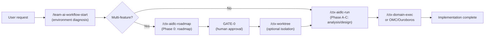

# aidlc-workflow

 

[English](README.md) · [한국어](README.ko.md) · **中文**

一套面向团队的工作流，用于系统化地完成 AI 需求分析、设计与验证。它确保重要决策由人类做出，同时让 AI 充分发挥其领域知识。

> **TL;DR** — 你只需要记住 `/team-ai-workflow-start`。它会诊断你的环境并告诉你下一步操作。

---

## 为什么需要它

- **AI 自行决定业务策略的问题** — 支付、退款、权限和通知策略必须始终由人类审批。
- **无门控自动实现的风险** — 未充分确认需求就直接实现，会导致低质量的结果。
- **缺乏团队标准** — 各项目采用不同标准进行分析，一致性无从保障。

---

## 它能给你带来什么

- **基于 CTX 的上下文管理** — 为每个项目显式定义规则、禁止项和可复用组件
- **人工门控** — 通过 GATE-0 到 GATE-5，在重大决策阶段由人类审查和批准
- **Unit of Work 分解** — 按大小（S/M/L）分解需求，规划实现顺序和并行化
- **多功能路线图** — 将大型计划分解为功能点，并自动规划团队分工
- **OMC/Ouroboros 集成** — 将已批准的需求接入 oh-my-claudecode autopilot/ralph 或 Ouroboros evolve
- **多账号/多仓库支持** — 同时管理多个 Claude 账号和 git 仓库

---

## 快速开始

### 第一步：克隆仓库

```bash
git clone https://github.com/TaeseongYun/aidlc-workflow.git ~/workspace/aidlc-workflow
export TEAM_AI_WORKFLOW_DIR="$HOME/workspace/aidlc-workflow"
echo 'export TEAM_AI_WORKFLOW_DIR="$HOME/workspace/aidlc-workflow"' >> ~/.zshrc
```

### 第二步：安装技能

```bash
bash ~/workspace/aidlc-workflow/scripts/install-skills.sh
```

**如果你使用多个 Claude 账号：**

```bash
CLAUDE_HOME="$HOME/.claude-personal" CODEX_HOME="$HOME/.codex-personal" \
  bash ~/workspace/aidlc-workflow/scripts/install-skills.sh
```

### 第三步：初始化项目

```bash
cd my-project
bash ~/workspace/aidlc-workflow/scripts/init-project.sh
```

现在你可以运行 `/team-ai-workflow-start` 了。

---

## 工作流概览



---

## 核心概念

### CTX：项目本地事实

在 `ctx/` 目录中定义项目的现有结构、技术栈、禁止项和可复用组件。所有分析和设计均以 CTX 为基础。

```
ctx/
├── INDEX.md                    # Project metadata
└── project-profile.ctx.md      # Tech stack, architecture, prohibition rules
```

### aidlc-docs：每个功能的产出物

每个功能的需求、问题、Units of Work 和技术设计均存储在 `aidlc-docs/features/<feature-name>/` 下，作为永久记录保存。

### GATE：人工审批检查点

- **GATE-0**：多功能路线图审批
- **GATE-1**：初始需求澄清审批
- **GATE-2、3**：最终需求与设计审批
- **GATE-4**：基础设施设计审批（条件性）
- **GATE-5**：实现就绪确认
- 条件性半门控 **2.5 / 2.7 / 3.5** 仅在各自的触发条件满足时启用（人物角色、组件、M/L 技术设计）——完整列表见 [common/stage-gate-rules.md](common/stage-gate-rules.md)

### Unit of Work：实现的基本单元

将需求分解为 S/M/L 大小的工作单元。每个 UOW 指定验收标准和验证方法。

### Platform Guidance：各平台架构基准

`platforms/<platform>/guidance.md`（android、ios、backend、frontend、flutter、rn、kmp）记录了 agent 在该平台进行设计（`/ctx-aidlc-run` STEP 6.5）或实现（`/ctx-domain-exec`）之前必须加载的架构基准。在 `ctx/project-profile.ctx.md` 中声明平台；优先级为：项目 `ctx/` > platform guidance > 通用知识。每个平台还附带详细的各平台专属技能——figma-to-code、vibe-coding 安全守卫、测试、设计系统、无障碍、i18n、可观测性和 contract-codegen。平台技能为**按需安装（opt-in）**：使用 `bash scripts/install-skills.sh --platforms=android,ios`（或 `--platforms=all`）安装你的技术栈所需的技能。这些文档为自包含的 Markdown 文件，因此外部仓库也可通过已安装路径或原始 GitHub URL 使用它们——参见 [platforms/README.md](platforms/README.md)。

有关概念的详细说明，请参见 [docs/concepts.md](docs/concepts.md)。

---

## 技能列表

| 技能 | 用途 |
|------|------|
| `/team-ai-workflow-start` | 入口点。环境诊断 + 路由到后续技能 |
| `/ctx-aidlc-roadmap` | Phase 0：多功能路线图分解（GATE-0） |
| `/ctx-worktree` | 将已批准的并行安全功能分配到独立的 git worktree |
| `/ctx-aidlc-run` | Phase A-C：需求分析、设计、产出物生成 |
| `/ctx-architect-judge` | 确定领域范围和 CTX 引用 |
| `/ctx-domain-exec` | 识别受影响的领域 |
| `/ctx-reviewer` | 验证是否存在 CTX 违规 |
| `/ctx-updater` | 更新代码/文档 |
| `/ctx-refiner` | 优化 CTX 文档 |
| `/ctx-commit-planner` | 设计提交结构 |
| `/ctx-score-loop` | 实现后在依赖项 + 4 个维度上自动迭代评分（分数超过 85 时完成） |
| `/ctx-hallucination-audit` | Hallucination Guard 审计循环。使用 graphify（codegraph 兜底）验证开发事实，隔离被反驳的声明，重复执行直到分数达到至少 87 |
| `/ctx-aidlc-sync` | 将 AWS AI-DLC 上游变更移植到本工作流仓库（同步分数超过 90 分才提交 PR） |
| `/mobile-webview-bridge` | 面向 Android/iOS/KMP/RN/Flutter 的 JS ↔ 原生 WebView 桥接，共享同一套契约优先协议（generator + guard 模式） |

> **Hallucination Guard（始终开启）。** 它通过代码图验证路径、符号、API、配置键和版本等开发事实，防止 AI 猜测以事实形式泄漏。`graphify`（`graphifyy[mcp]`）在初始设置中**强烈推荐**但并非必需（codegraph 为可选兜底）。如果缺少 `graphify`，`/team-ai-workflow-start` 会通过对话框询问：安装 / 以降级（degraded）模式继续 / 取消；降级模式下 VERIFY 回退到 grep/Read。规则位于：`extensions/hallucination-guard/`；指南：`docs/hallucination-guard.md`。

---

## OMC / Ouroboros 集成

team-ai-workflow 决定"**构建什么**"。oh-my-claudecode（OMC）和 Ouroboros 负责"**如何自动实现**"。

### 集成模式

| 模式 | 使用场景 | 流水线 |
|------|---------|----------|
| **OMC autopilot** | 自动化整个实现过程 | `/ctx-aidlc-run` → GATE 审批 → `/oh-my-claudecode:autopilot` |
| **OMC ralph** | 小功能的完成循环 | `/ctx-aidlc-run` → `/oh-my-claudecode:ralph` |
| **OMC team** | 多功能并行处理 | `/ctx-aidlc-roadmap` → GATE-0 → `/oh-my-claudecode:team` |
| **Ouroboros evolve** | 进化式迭代设计/实现 | `/ctx-aidlc-run` → `ouroboros_evolve_step` |

有关详细模式和配置，请参见 [docs/omc-ouroboros-integration.md](docs/omc-ouroboros-integration.md)。

### 约束层——ponytail 集成

如果 team-ai-workflow 处理"**构建什么**"，OMC/Ouroboros 处理"**如何自动实现**"，
那么 [ponytail](https://github.com/DietrichGebert/ponytail) 处理"**用最少的代码实现**"。
它在实现之前（`/ctx-domain-exec`）应用一个 7 步约束阶梯，防止过度工程化。
即使不安装插件，仅凭 [core/lazy-implementation.md](core/lazy-implementation.md) 的规则也能运作，
且它从不削减安全守卫（验证、安全、AC、策略）。

集成方式：[docs/ponytail-integration.md](docs/ponytail-integration.md)

---

## 在其他账号/仓库中使用

要在多个 Claude 账号或其他 git 仓库上安装相同的工作流：

```bash
# 在个人账号上额外安装
CLAUDE_HOME="$HOME/.claude-personal" bash ~/workspace/aidlc-workflow/scripts/install-skills.sh

# 在工作账号上额外安装
CLAUDE_HOME="$HOME/.claude-work" bash ~/workspace/aidlc-workflow/scripts/install-skills.sh
```

每个项目只需初始化一次：

```bash
cd other-project
bash ~/workspace/aidlc-workflow/scripts/init-project.sh
```

详细的多账号配置：[docs/omc-ouroboros-integration.md](docs/omc-ouroboros-integration.md)

---

## 目录结构

```text
aidlc-workflow/
├── core/                       # Common analysis logic (input validation, units generation)
├── common/                     # Common rules (question governance, depth levels, gates, recovery)
├── extensions/                 # Rule packs
│   ├── performance|security|api-contract/   # Optional (opt-in)
│   └── hallucination-guard/    # Always on: guard rules + Linear routing
├── platforms/                  # Per-platform guidance + skills (android, ios, backend, frontend, flutter, rn, kmp)
├── skills/                     # Skill sources (deployed by install-skills.sh)
│   ├── team-ai-workflow-start/
│   ├── ctx-aidlc-roadmap/
│   ├── ctx-worktree/
│   ├── ctx-aidlc-run/
│   ├── ctx-score-loop/
│   ├── ctx-hallucination-audit/
│   └── ... (12 skills)
├── tools/                      # Validation tools (evaluator, skill-validator)
├── scripts/                    # Installation and initialization
│   ├── install-skills.sh       # Global skill installation
│   ├── init-project.sh         # Create per-project ctx/, aidlc-docs/ and check code graph prerequisites
│   ├── check-graphify.sh       # graphify + graph.json prerequisite gate (codegraph fallback)
│   └── harvest-assumptions.sh  # Collect uncertainty markers for the audit loop
├── templates/                  # Document templates
├── docs/                       # Detailed guides
│   ├── concepts.md             # CTX, aidlc-docs, GATE concepts
│   ├── workflow-guide.md       # Per-phase execution guide
│   ├── omc-ouroboros-integration.md
│   ├── brownfield-guide.md
│   ├── faq.md
│   └── changelog/              # Per-version change history
├── examples/                   # References (golden baselines, multi-feature coordination)
├── QUICKSTART.md               # Korean quick start
└── README.md                   # This file
```

---

## 产出物结构

每个功能的工作产出物按以下结构组织：

```text
aidlc-docs/
├── aidlc-state.md             # Project/roadmap state
├── audit.md                   # Audit trail
├── _roadmap.md                # Multi-feature roadmap (optional)
└── features/<feature-slug>/
    ├── status.md              # Feature card + Readiness Score
    ├── requirements.md        # Final requirements
    ├── requirement-verification-questions.md  # Open questions
    ├── unit-of-work.md        # UOW decomposition (S/M/L)
    ├── technical-design.md    # Technical design (M/L only)
    └── infrastructure-design.md (conditional)
```

---

## 贡献

该工作流是所有项目共享的标准，欢迎提出改进建议。

### 如何贡献

1. **提交 Issue**：使用 GitHub Issues 提交功能请求或错误报告
2. **提交 PR**：使用 Pull Request 改进文档或技能
3. **修改方式**：
   - 仅在 `skills/` 目录中进行编辑
   - 编辑后运行 `bash scripts/install-skills.sh`
   - 提交信息使用英文

详细的贡献指南，请参见 [CONTRIBUTING.md](CONTRIBUTING.md)。

---

## 变更历史

各版本详细变更：[docs/changelog/](docs/changelog/)

主要更新：
- **2026-09-14**：`mobile-webview-bridge` 技能——面向 Android/iOS/KMP/RN/Flutter 的 JS ↔ 原生 WebView 桥接，共享同一套契约优先协议（信封、握手、安全、线程、生命周期），附各平台参考绑定、generator/guard 两种模式以及离线信封验证器（[详情](docs/changelog/2026-09-14-mobile-webview-bridge-skill.md)）
- **2026-09-06**：运行结果日志器——`scripts/run-logger.ts` 将类型化结果记录到 `aidlc-docs/run-log.ndjson` 以及可供 graphify 摄取的 `run-log.md` 镜像，使历史结果可通过 `graphify query`（降级模式下用本地 `recall`）检索；已接入 score-loop、hallucination-audit、aidlc-run 和会话入口（[详情](docs/changelog/2026-09-06-run-logger-and-graphify-rag.md)）
- **2026-09-03**：`graphify` 改为软依赖——缺少该工具时降级为 grep/Read 验证，不再阻塞设置；新增 CI（`validate-skills.sh` + golden baselines），并让 `validate-questions.sh` 接受英文字段标签（[详情](docs/changelog/2026-09-03-graphify-soft-dependency-and-ci.md)）
- **2026-08-27**：新增 KMP（Kotlin Multiplatform）作为第 7 个平台——guidance + 13 个技能（figma-to-kmp、vibe-coding 安全守卫、测试等）
- **2026-08-26**：跨平台每平台技能家族（测试、设计系统、无障碍、contract-codegen、可观测性、i18n）
- **2026-04-29**：新增 Phase 0 路线图规划技能，正式化多功能协作工作流
- **2026-04-22**：过度自信预防、强化验证、评估框架
- **2026-04-14**：延迟加载 + 会话分离作为默认模型，Token 精简

---

## 许可证

MIT License。详情请参见 [LICENSE](LICENSE)。

---

## 了解更多

- [快速开始指南](QUICKSTART.md) — 分步安装与基本用法
- [工作流指南](docs/workflow-guide.md) — 各阶段详细执行流程
- [核心概念](docs/concepts.md) — CTX、aidlc-docs、gates、Unit of Work
- [OMC/Ouroboros 集成](docs/omc-ouroboros-integration.md) — 接入自动化层
- [Ponytail 集成](docs/ponytail-integration.md) — 接入代码约束层
- [Brownfield 指南](docs/brownfield-guide.md) — 分析现有系统
- [FAQ](docs/faq.md) — 常见问题与检查清单
