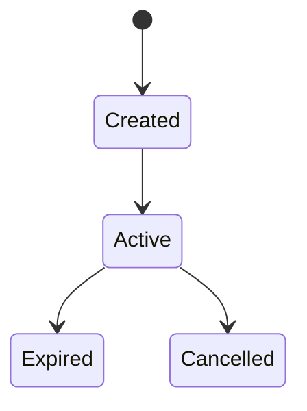

# Diagram Standards

## 목적
산출물에 포함되는 다이어그램의 품질과 호환성을 보장한다.

## 사용 시점
- requirements.md: 상태 전이, 사용자 플로우가 복잡할 때
- unit-of-work.md: 의존성 관계도
- planning-draft.md: 핵심 시나리오 흐름이 시각화가 필요할 때
- technical-design.md: 모듈 간 상호작용, 시퀀스 다이어그램, ERD

다이어그램은 필수가 아니다. 텍스트로 충분히 전달되면 생략한다.

## ASCII 다이어그램

### 허용 문자
`+` `-` `|` `^` `v` `<` `>` 및 영숫자/한글 텍스트, 공백

### 금지 문자
유니코드 박스 문자: `┌` `─` `│` `└` `┐` `┘` `├` `┤` `┬` `┴` `┼`
- 이유: 폰트/플랫폼별 렌더링 불일치

### 폭 규칙
박스 내 모든 줄은 동일한 문자 수를 유지한다 (공백 포함).

### 패턴

#### 박스
```
+-------------------------------------------+
|                                           |
|              Component Name               |
|                                           |
|  설명 텍스트                                |
|                                           |
+-------------------------------------------+
```

#### 중첩 박스
```
+-----------------------------------------------+
|              Outer Component                  |
|  +-----------------------------------------+  |
|  |  Inner Component                        |  |
|  |  - 항목 1                                |  |
|  |  - 항목 2                                |  |
|  +-----------------------------------------+  |
+-----------------------------------------------+
```

#### 수직 플로우
```
+----------+
|  입력    |
+----------+
     |
     | 검증
     v
+----------+
|  처리    |
+----------+
     |
     | 반환
     v
+----------+
|  출력    |
+----------+
```

#### 수평 플로우
```
+-------+     +-------+     +-------+
| Step1 | --> | Step2 | --> | Step3 |
+-------+     +-------+     +-------+
```

### 검증 체크리스트
- [ ] 기본 ASCII 문자만 사용
- [ ] 유니코드 박스 문자 없음
- [ ] 정렬에 공백만 사용 (탭 금지)
- [ ] 모서리에 `+` 사용
- [ ] 박스 내 모든 줄 동일 폭

## Mermaid 다이어그램

복잡한 관계나 상태 전이는 Mermaid를 사용할 수 있다.

### 검증 규칙
1. 노드 ID는 영숫자 + 밑줄만 사용
2. 라벨 내 특수문자 이스케이프: `"` -> `\"`, `'` -> `\'`
3. 문법 오류가 없는지 확인 후 파일에 기록

### 폴백 규칙
Mermaid 다이어그램을 포함할 때는 반드시 텍스트 대안을 함께 제공한다.

```markdown
### 상태 전이도



### 텍스트 대안
- [시작] -> Created -> Active -> Expired
- Active -> Cancelled
```

### 권장 다이어그램 유형

| 상황 | 다이어그램 유형 |
|------|----------------|
| 상태 변화가 있는 엔티티 | `stateDiagram-v2` |
| 작업 의존성 | `flowchart TD` |
| 시스템 간 호출 순서 | `sequenceDiagram` |
| 엔티티 관계 | `erDiagram` |

## 규칙
- 다이어그램은 이해를 돕기 위한 보조 수단이다. 텍스트 설명을 대체하지 않는다.
- 다이어그램이 5개 이상의 노드를 포함하면 텍스트 대안을 반드시 제공한다.
- ASCII와 Mermaid 중 상황에 맞는 것을 선택한다. 단순 플로우는 ASCII, 복잡한 관계는 Mermaid.
