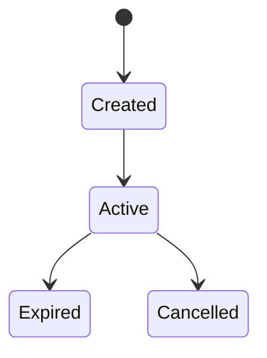

# Diagram Standards

## Purpose
Ensures the quality and compatibility of diagrams included in artifacts.

## When to Use
- requirements.md: When state transitions or user flows are complex
- unit-of-work.md: Dependency relationship diagrams
- planning-draft.md: When core scenario flows need visualization
- technical-design.md: Inter-module interactions, sequence diagrams, ERD

Diagrams are not mandatory. Omit them when text conveys the information sufficiently.

## ASCII Diagrams

### Allowed Characters
`+` `-` `|` `^` `v` `<` `>` and alphanumeric/Korean text, whitespace

### Forbidden Characters
Unicode box-drawing characters: `┌` `─` `│` `└` `┐` `┘` `├` `┤` `┬` `┴` `┼`
- Reason: rendering inconsistency across fonts/platforms

### Width Rule
Every line within a box maintains the same character count (including whitespace).

### Patterns

#### Box
```
+-------------------------------------------+
|                                           |
|              Component Name               |
|                                           |
|  Description text                         |
|                                           |
+-------------------------------------------+
```

#### Nested Box
```
+-----------------------------------------------+
|              Outer Component                  |
|  +-----------------------------------------+  |
|  |  Inner Component                        |  |
|  |  - Item 1                               |  |
|  |  - Item 2                               |  |
|  +-----------------------------------------+  |
+-----------------------------------------------+
```

#### Vertical Flow
```
+----------+
|  Input   |
+----------+
     |
     | Validate
     v
+----------+
| Process  |
+----------+
     |
     | Return
     v
+----------+
|  Output  |
+----------+
```

#### Horizontal Flow
```
+-------+     +-------+     +-------+
| Step1 | --> | Step2 | --> | Step3 |
+-------+     +-------+     +-------+
```

### Validation Checklist
- [ ] Uses only basic ASCII characters
- [ ] No Unicode box-drawing characters
- [ ] Uses only whitespace for alignment (no tabs)
- [ ] Uses `+` at corners
- [ ] Every line within a box is the same width

## Mermaid Diagrams

You may use Mermaid for complex relationships or state transitions.

### Validation Rules
1. Node IDs use only alphanumerics + underscores
2. Escape special characters within labels: `"` -> `\"`, `'` -> `\'`
3. Confirm there are no syntax errors before writing to the file

### Fallback Rule
When including a Mermaid diagram, always provide a text alternative alongside.

```markdown
### State Transition Diagram


```mermaid
stateDiagram-v2
    [*] --> Created
    Created --> Active
    Active --> Expired
    Active --> Cancelled
```

### Text Alternative
- [Start] -> Created -> Active -> Expired
- Active -> Cancelled
```

### Recommended Diagram Types

| Situation | Diagram Type |
|------|----------------|
| Entity with state changes | `stateDiagram-v2` |
| Task dependencies | `flowchart TD` |
| Call order between systems | `sequenceDiagram` |
| Entity relationships | `erDiagram` |

## Rules
- A diagram is a supporting aid to understanding. It does not replace textual explanation.
- If a diagram contains 5 or more nodes, always provide a text alternative.
- Choose between ASCII and Mermaid depending on the situation. ASCII for simple flows, Mermaid for complex relationships.
