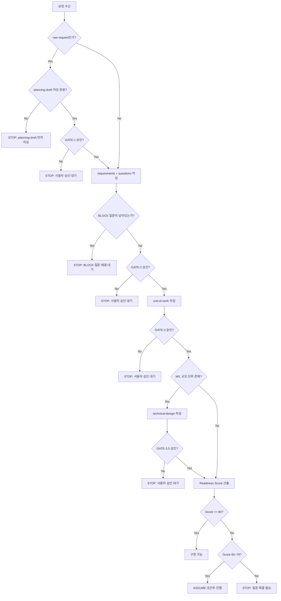

# Stop Conditions

워크플로우에서 "멈춰야 하는 시점"을 한곳에 정리한 문서다.
아래 조건 중 하나라도 해당하면 구현으로 진행하지 않는다.

## Decision Tree

## 정책 기반 STOP 조건

아래 항목이 명시적으로 확정되지 않았으면 구현에 진입하지 않는다.
출처: `common/stage-gate-rules.md` 승인 필요 항목, `skills/ctx-aidlc-run/SKILL.md` WHEN TO STOP

| 조건 | 출처 |
|------|------|
| 환불/취소 정책이 미확정 | stage-gate-rules.md |
| 정산 기준이 미확정 | stage-gate-rules.md |
| 할인 우선순위/비용 부담 주체 미확정 | stage-gate-rules.md |
| 권한/역할 규칙 미확정 | stage-gate-rules.md |
| 외부 연동 방식 미확정 | stage-gate-rules.md |
| 알림 타이밍/채널 정책 미확정 | ctx-aidlc-run WHEN TO STOP |
| 기존 CTX와 새 요청이 충돌 | ctx-aidlc-run WHEN TO STOP |
| 복수 설계가 유효하고 ADR로 해소 불가 | ctx-aidlc-run WHEN TO STOP |
| technical-design.md Open Items에 미해결 항목 존재 | ctx-aidlc-run WHEN TO STOP |

## 게이트 기반 STOP 조건

| 게이트 | STOP 조건 |
|--------|----------|
| GATE-1 | 사용자가 planning-draft를 승인하지 않음 |
| GATE-2 | 사용자가 requirements를 승인하지 않음, 또는 BLOCK 질문 미해결 |
| GATE-3 | 사용자가 unit-of-work를 승인하지 않음, 또는 UOW 규모 필드 누락 |
| GATE-3.5 | 사용자가 technical-design을 승인하지 않음 |

## Readiness Score 기반 STOP

| 점수 | 판정 | 동작 |
|------|------|------|
| 80+ | READY | 구현 가능 |
| 60~79 | CONDITIONAL | ASSUME 조건 명시 후 진행 가능. 재작업 위험 있음 |
| 0~59 | NOT_READY | 구현 금지. BLOCK 질문 해결 필요 |
