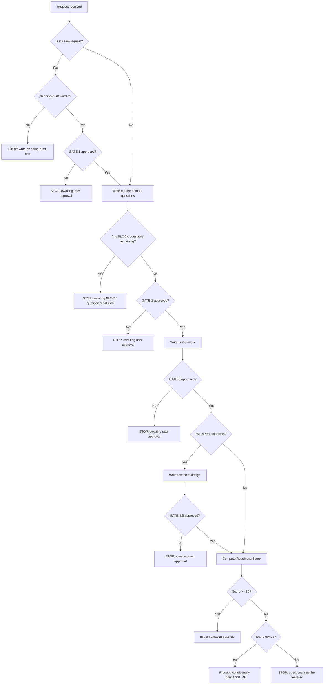

# Stop Conditions

A document that gathers in one place the points in the workflow where "you must stop."
If any one of the conditions below applies, do not proceed to implementation.

## Decision Tree

```mermaid
flowchart TD
    A[Request received] --> B{Is it a raw-request?}
    B -->|Yes| C{planning-draft written?}
    C -->|No| STOP1[STOP: write planning-draft first]
    C -->|Yes| D{GATE-1 approved?}
    D -->|No| STOP2[STOP: awaiting user approval]
    B -->|No| E[Write requirements + questions]

    D -->|Yes| E
    E --> F{Any BLOCK questions remaining?}
    F -->|Yes| STOP3[STOP: awaiting BLOCK question resolution]
    F -->|No| G{GATE-2 approved?}
    G -->|No| STOP4[STOP: awaiting user approval]
    G -->|Yes| H[Write unit-of-work]

    H --> I{GATE-3 approved?}
    I -->|No| STOP5[STOP: awaiting user approval]
    I -->|Yes| J{M/L-sized unit exists?}
    J -->|Yes| K[Write technical-design]
    J -->|No| L[Compute Readiness Score]

    K --> M{GATE-3.5 approved?}
    M -->|No| STOP6[STOP: awaiting user approval]
    M -->|Yes| L

    L --> N{Score >= 80?}
    N -->|Yes| READY[Implementation possible]
    N -->|No| O{Score 60~79?}
    O -->|Yes| CONDITIONAL[Proceed conditionally under ASSUME]
    O -->|No| STOP7[STOP: questions must be resolved]
```

## Policy-based STOP conditions

If the following items are not explicitly confirmed, do not enter implementation.
Sources: `common/stage-gate-rules.md` items requiring approval, `skills/ctx-aidlc-run/SKILL.md` WHEN TO STOP

| Condition | Source |
|-----------|--------|
| Refund/cancellation policy unconfirmed | stage-gate-rules.md |
| Settlement criteria unconfirmed | stage-gate-rules.md |
| Discount priority / cost-bearer unconfirmed | stage-gate-rules.md |
| Permission/role rules unconfirmed | stage-gate-rules.md |
| External integration method unconfirmed | stage-gate-rules.md |
| Notification timing/channel policy unconfirmed | ctx-aidlc-run WHEN TO STOP |
| Existing CTX conflicts with the new request | ctx-aidlc-run WHEN TO STOP |
| Multiple designs are valid and cannot be resolved by an ADR | ctx-aidlc-run WHEN TO STOP |
| Unresolved items exist in technical-design.md Open Items | ctx-aidlc-run WHEN TO STOP |

## Gate-based STOP conditions

| Gate | STOP condition |
|------|----------------|
| GATE-1 | User has not approved the planning-draft |
| GATE-2 | User has not approved the requirements, or BLOCK questions are unresolved |
| GATE-3 | User has not approved the unit-of-work, or the UOW size field is missing |
| GATE-3.5 | User has not approved the technical-design |

## Readiness Score-based STOP

| Score | Verdict | Action |
|-------|---------|--------|
| 80+ | READY | Implementation possible |
| 60~79 | CONDITIONAL | Can proceed after stating ASSUME conditions. Rework risk exists |
| 0~59 | NOT_READY | Implementation prohibited. BLOCK questions must be resolved |
