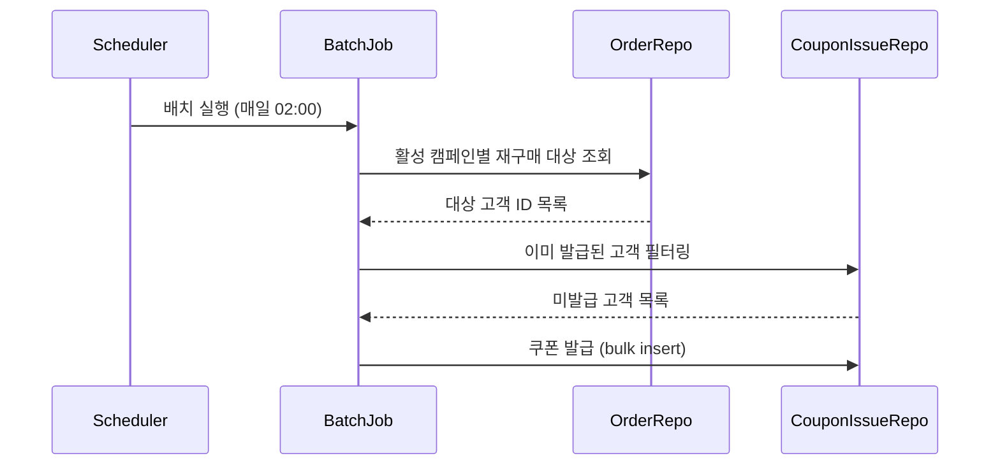

<!-- workflow-step: STEP-6.5 | gate: GATE-3.5 | producer: ctx-aidlc-run | condition: M/L units exist -->
# Technical Design

선행 산출물:
- `requirements.md`
- `unit-of-work.md`

대상 UOW (M/L 규모):
- UOW-3: 쿠폰 자동 발급 배치 (M)
- UOW-5: 쿠폰 사용 검증 및 결제 연동 (M)

---

## 1. Design Overview

재구매 캠페인 쿠폰 자동 발급 및 결제 시 쿠폰 적용 기능의 기술 설계다.

- 대상 모듈: campaign (신규), coupon (기존 확장), payment (기존 수정)
- brownfield 연결점: 기존 `coupon` 도메인의 JPA + Spring Data 패턴을 따른다. 기존 `payment` 도메인의 Strategy 패턴 할인 적용 구조에 캠페인 쿠폰 전략을 추가한다.

---

## 2. Architecture Decisions

### ADR-1: 캠페인 쿠폰 테이블 분리 vs 기존 쿠폰 테이블 확장

- 맥락: 기존 `coupon` 테이블은 수동 발급 전용. 캠페인 쿠폰은 자동 발급, 캠페인 단위 관리, 사용 조건이 다름.
- 선택지:
  - A) 기존 `coupon` 테이블에 `campaign_id` 컬럼 추가 → 마이그레이션 간단, 기존 쿠폰 쿼리에 영향
  - B) `campaign`, `coupon_issue` 별도 테이블 생성 → 기존 쿠폰 영향 없음, 테이블 2개 추가
- 결정: B) 별도 테이블
- 영향: 기존 쿠폰 도메인 수정 없음. campaign 패키지 신규 생성. 결제 연동 시 쿠폰 타입 분기 필요.

### ADR-2: 배치 발급 방식 — Spring Batch vs 단순 스케줄러

- 맥락: 대상 고객 10만 건 이상 예상. 기존 프로젝트에 Spring Batch 의존성 있음.
- 선택지:
  - A) Spring Batch Job → chunk 단위 처리, 재시작/실패 복구 내장
  - B) @Scheduled + 페이징 쿼리 → 단순, 의존성 추가 없음, 실패 복구 직접 구현
- 결정: A) Spring Batch
- 영향: 기존 배치 인프라 재사용. Job/Step 설정 추가. 배치 메타 테이블 기존 것 공유.

---

## 3. API Specification

### POST /admin/campaigns
캠페인 생성

Request:
```json
{
  "name": "재구매 30일 할인",
  "periodDays": 30,
  "minOrderAmount": 15000,
  "discountAmount": 3000,
  "validDays": 14,
  "active": false
}
```

Response (201):
```json
{
  "campaignId": 1,
  "name": "재구매 30일 할인",
  "periodDays": 30,
  "minOrderAmount": 15000,
  "discountAmount": 3000,
  "validDays": 14,
  "active": false,
  "createdAt": "2026-03-20T14:00:00Z"
}
```

Error:
- 400: 필수 필드 누락
- 409: 동일 이름 캠페인 존재

### PATCH /admin/campaigns/{campaignId}/toggle
캠페인 ON/OFF

Response (200):
```json
{
  "campaignId": 1,
  "active": true
}
```

### GET /admin/campaigns/{campaignId}/stats
발급/사용 현황

Response (200):
```json
{
  "campaignId": 1,
  "issuedCount": 8523,
  "usedCount": 1204,
  "usageRate": 0.141
}
```

---

## 4. Data Model

| Entity | Field | Type | Constraints | Notes |
|--------|-------|------|-------------|-------|
| Campaign | id | BIGINT | PK, AUTO_INCREMENT | |
| Campaign | name | VARCHAR(100) | NOT NULL, UNIQUE | 캠페인 이름 |
| Campaign | period_days | INT | NOT NULL | 재구매 판정 기간 |
| Campaign | min_order_amount | INT | NOT NULL | 최소 주문 금액 |
| Campaign | discount_amount | INT | NOT NULL | 할인 금액 (정액) |
| Campaign | valid_days | INT | NOT NULL | 쿠폰 유효 기간 (일) |
| Campaign | active | BOOLEAN | NOT NULL, DEFAULT false | ON/OFF |
| Campaign | created_at | DATETIME | NOT NULL | |
| CouponIssue | id | BIGINT | PK, AUTO_INCREMENT | |
| CouponIssue | campaign_id | BIGINT | FK → Campaign, NOT NULL | |
| CouponIssue | user_id | BIGINT | NOT NULL | |
| CouponIssue | issued_at | DATETIME | NOT NULL | |
| CouponIssue | expires_at | DATETIME | NOT NULL | issued_at + valid_days |
| CouponIssue | used_at | DATETIME | NULLABLE | 사용 시 기록 |
| CouponIssue | order_id | BIGINT | NULLABLE, FK → Order | 사용된 주문 |

Unique constraint: `(campaign_id, user_id)` — 1인 1캠페인 1쿠폰

Migration strategy:
- 신규 테이블 2개 생성 (기존 테이블 변경 없음)
- Flyway migration script: `V{next}__create_campaign_tables.sql`

---

## 5. Module/Component Structure

| Module/Class | Responsibility | New/Change | Target UOW |
|-------------|----------------|------------|------------|
| `campaign/entity/Campaign.java` | 캠페인 엔티티 | New | UOW-1 |
| `campaign/entity/CouponIssue.java` | 발급 이력 엔티티 | New | UOW-1 |
| `campaign/repository/CampaignRepository.java` | 캠페인 CRUD | New | UOW-1 |
| `campaign/repository/CouponIssueRepository.java` | 발급 이력 CRUD | New | UOW-1 |
| `order/repository/OrderRepository.java` | 재구매 판정 쿼리 추가 | Change | UOW-2 |
| `campaign/batch/CouponIssueBatchJob.java` | 배치 Job/Step 정의 | New | UOW-3 |
| `campaign/batch/CouponIssueProcessor.java` | 대상 필터링 + 발급 | New | UOW-3 |
| `campaign/controller/AdminCampaignController.java` | 관리자 API | New | UOW-4 |
| `payment/service/DiscountStrategy.java` | 캠페인 쿠폰 할인 전략 추가 | Change | UOW-5 |
| `coupon/service/CampaignCouponValidator.java` | 쿠폰 유효성 검증 | New | UOW-5 |
| `campaign/controller/CampaignStatsController.java` | 현황 조회 API | New | UOW-6 |

---

## 6. Interaction Flow



텍스트 대안:
1. 스케줄러가 매일 02:00에 배치 실행
2. 활성 캠페인마다 재구매 대상 고객 조회
3. 이미 발급된 고객 제외
4. 미발급 고객에게 쿠폰 bulk insert

---

## 7. Non-functional Design

- 성능: 배치 chunk size 500, 10만 건 기준 5분 이내 목표. 재구매 판정 쿼리에 `(user_id, paid_at)` 인덱스 필요.
- 정합성: `(campaign_id, user_id)` unique constraint로 중복 발급 방지. 배치 실패 시 Spring Batch 재시작으로 미처리 건만 재처리.
- 운영: 배치 실행 로그를 Spring Batch 메타 테이블로 관리. 캠페인 ON/OFF로 발급 즉시 중단 가능.

---

## 8. Testing Approach

| UOW | Test Type | Verification |
|-----|-----------|-------------|
| UOW-1 | Unit | Entity 생성, Repository CRUD |
| UOW-2 | Unit | 기간 조건별 재구매 대상 반환 정확성 |
| UOW-3 | Integration | 배치 실행 → 발급 건수 검증, 중복 발급 차단 검증, chunk 단위 롤백 검증 |
| UOW-4 | Integration | 캠페인 CRUD API 동작, ON/OFF 토글 |
| UOW-5 | Integration | 유효 쿠폰 할인 적용, 만료 쿠폰 차단, 최소 금액 미달 차단 |
| UOW-6 | Integration | 발급/사용 통계 정확성 |

---

## 9. Open Items

없음
