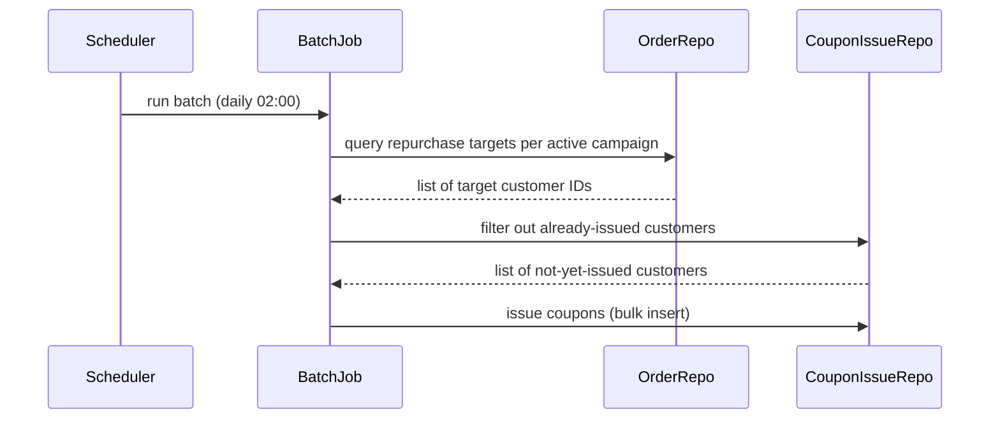

<!-- workflow-step: STEP-6.5 | gate: GATE-3.5 | producer: ctx-aidlc-run | condition: M/L units exist -->
# Technical Design

Prerequisite outputs:
- `requirements.md`
- `unit-of-work.md`

Target UOWs (M/L size):
- UOW-3: Coupon auto-issuance batch (M)
- UOW-5: Coupon usage validation and payment integration (M)

---

## 1. Design Overview

This is the technical design for the repurchase campaign coupon auto-issuance feature and coupon application at payment time.

- Target modules: campaign (new), coupon (existing extension), payment (existing modification)
- brownfield connection points: follow the JPA + Spring Data pattern of the existing `coupon` domain. Add a campaign coupon strategy to the Strategy-pattern discount-application structure of the existing `payment` domain.

---

## 2. Architecture Decisions

### ADR-1: Separate campaign coupon table vs. extending the existing coupon table

- Context: the existing `coupon` table is for manual issuance only. Campaign coupons differ in auto-issuance, per-campaign management, and usage conditions.
- Options:
  - A) Add a `campaign_id` column to the existing `coupon` table → simple migration, affects existing coupon queries
  - B) Create separate `campaign` and `coupon_issue` tables → no impact on existing coupons, adds 2 tables
- Decision: B) separate tables
- Impact: no modification to the existing coupon domain. A new campaign package is created. Coupon-type branching is needed for payment integration.

### ADR-2: Batch issuance method — Spring Batch vs. a simple scheduler

- Context: over 100,000 target customers are expected. The existing project has a Spring Batch dependency.
- Options:
  - A) Spring Batch Job → chunk-level processing, built-in restart/failure recovery
  - B) @Scheduled + paging query → simple, no added dependency, failure recovery implemented manually
- Decision: A) Spring Batch
- Impact: reuse the existing batch infrastructure. Add Job/Step configuration. Share the existing batch metadata tables.

---

## 3. API Specification

### POST /admin/campaigns
Create a campaign

Request:
```json
{
  "name": "Repurchase 30-Day Discount",
  "periodDays": 30,
  "minOrderAmount": 15000,
  "discountAmount": 3000,
  "validDays": 14,
  "active": false
}
```

Response (201):
```json
{
  "campaignId": 1,
  "name": "Repurchase 30-Day Discount",
  "periodDays": 30,
  "minOrderAmount": 15000,
  "discountAmount": 3000,
  "validDays": 14,
  "active": false,
  "createdAt": "2026-03-20T14:00:00Z"
}
```

Error:
- 400: required field missing
- 409: a campaign with the same name exists

### PATCH /admin/campaigns/{campaignId}/toggle
Campaign ON/OFF

Response (200):
```json
{
  "campaignId": 1,
  "active": true
}
```

### GET /admin/campaigns/{campaignId}/stats
Issuance/usage status

Response (200):
```json
{
  "campaignId": 1,
  "issuedCount": 8523,
  "usedCount": 1204,
  "usageRate": 0.141
}
```

---

## 4. Data Model

| Entity | Field | Type | Constraints | Notes |
|--------|-------|------|-------------|-------|
| Campaign | id | BIGINT | PK, AUTO_INCREMENT | |
| Campaign | name | VARCHAR(100) | NOT NULL, UNIQUE | campaign name |
| Campaign | period_days | INT | NOT NULL | repurchase determination period |
| Campaign | min_order_amount | INT | NOT NULL | minimum order amount |
| Campaign | discount_amount | INT | NOT NULL | discount amount (fixed) |
| Campaign | valid_days | INT | NOT NULL | coupon validity period (days) |
| Campaign | active | BOOLEAN | NOT NULL, DEFAULT false | ON/OFF |
| Campaign | created_at | DATETIME | NOT NULL | |
| CouponIssue | id | BIGINT | PK, AUTO_INCREMENT | |
| CouponIssue | campaign_id | BIGINT | FK → Campaign, NOT NULL | |
| CouponIssue | user_id | BIGINT | NOT NULL | |
| CouponIssue | issued_at | DATETIME | NOT NULL | |
| CouponIssue | expires_at | DATETIME | NOT NULL | issued_at + valid_days |
| CouponIssue | used_at | DATETIME | NULLABLE | recorded on use |
| CouponIssue | order_id | BIGINT | NULLABLE, FK → Order | the order it was used on |

Unique constraint: `(campaign_id, user_id)` — 1 coupon per person per campaign

Migration strategy:
- Create 2 new tables (no changes to existing tables)
- Flyway migration script: `V{next}__create_campaign_tables.sql`

---

## 5. Module/Component Structure

| Module/Class | Responsibility | New/Change | Target UOW |
|-------------|----------------|------------|------------|
| `campaign/entity/Campaign.java` | campaign entity | New | UOW-1 |
| `campaign/entity/CouponIssue.java` | issuance history entity | New | UOW-1 |
| `campaign/repository/CampaignRepository.java` | campaign CRUD | New | UOW-1 |
| `campaign/repository/CouponIssueRepository.java` | issuance history CRUD | New | UOW-1 |
| `order/repository/OrderRepository.java` | add repurchase determination query | Change | UOW-2 |
| `campaign/batch/CouponIssueBatchJob.java` | batch Job/Step definition | New | UOW-3 |
| `campaign/batch/CouponIssueProcessor.java` | target filtering + issuance | New | UOW-3 |
| `campaign/controller/AdminCampaignController.java` | administrator API | New | UOW-4 |
| `payment/service/DiscountStrategy.java` | add campaign coupon discount strategy | Change | UOW-5 |
| `coupon/service/CampaignCouponValidator.java` | coupon validity check | New | UOW-5 |
| `campaign/controller/CampaignStatsController.java` | status query API | New | UOW-6 |

---

## 6. Interaction Flow


```mermaid
sequenceDiagram
    participant Scheduler
    participant BatchJob
    participant OrderRepo
    participant CouponIssueRepo

    Scheduler->>BatchJob: run batch (daily 02:00)
    BatchJob->>OrderRepo: query repurchase targets per active campaign
    OrderRepo-->>BatchJob: list of target customer IDs
    BatchJob->>CouponIssueRepo: filter out already-issued customers
    CouponIssueRepo-->>BatchJob: list of not-yet-issued customers
    BatchJob->>CouponIssueRepo: issue coupons (bulk insert)
```

Text alternative:
1. The scheduler runs the batch every day at 02:00
2. For each active campaign, query the repurchase-target customers
3. Exclude customers who have already been issued a coupon
4. Bulk insert coupons for the customers who have not been issued one

---

## 7. Non-functional Design

- Performance: batch chunk size 500, target of completing within 5 minutes for 100,000 records. The repurchase determination query needs a `(user_id, paid_at)` index.
- Consistency: prevent duplicate issuance via the `(campaign_id, user_id)` unique constraint. On batch failure, only the unprocessed records are reprocessed via Spring Batch restart.
- Operations: manage batch execution logs via the Spring Batch metadata tables. Issuance can be stopped immediately via campaign ON/OFF.

---

## 8. Testing Approach

| UOW | Test Type | Verification |
|-----|-----------|-------------|
| UOW-1 | Unit | Entity creation, Repository CRUD |
| UOW-2 | Unit | accuracy of repurchase targets returned per period condition |
| UOW-3 | Integration | run batch → verify issuance count, verify duplicate-issuance blocking, verify chunk-level rollback |
| UOW-4 | Integration | campaign CRUD API operation, ON/OFF toggle |
| UOW-5 | Integration | valid coupon discount application, expired coupon blocking, below-minimum-amount blocking |
| UOW-6 | Integration | accuracy of issuance/usage statistics |

---

## 9. Open Items

None
