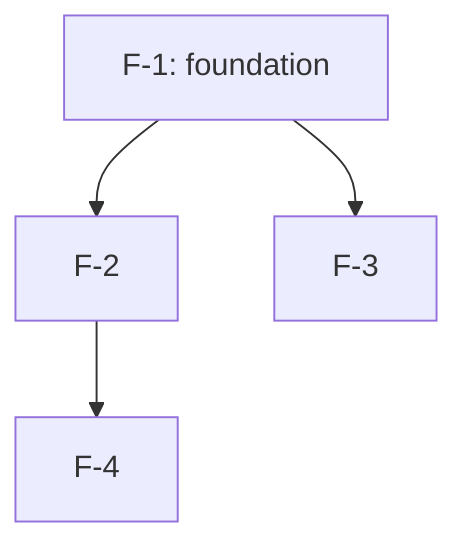

<!-- workflow-step: STEP-R6 | gate: GATE-0 | producer: ctx-aidlc-roadmap | condition: multi-feature prepared-requirement -->
# Feature Roadmap

이 파일은 `aidlc-docs/_roadmap.md`(프로젝트 레벨)에 생성한다. 단일 피처 작업에는 사용하지 않는다.

선행 입력:
- prepared-requirement 원본 기획서
- `ctx/INDEX.md`, `ctx/project-profile.ctx.md`
- (brownfield) `aidlc-docs/reverse-engineering/*`

관련 상태 파일:
- `aidlc-docs/aidlc-state.md` (Roadmap State, Feature Index, Cross-Feature Dependencies 동기화)
- `aidlc-docs/audit.md` (Phase 0 STEP/GATE-0/HANDOFF 이벤트)

---

## 1. Source Document

- 원본 경로:
- 분류: prepared-requirement
- 수령일:
- 작성 책임자(로드맵 작성자):
- Depth Level: minimal / standard / comprehensive

## 2. Feature List

| Feature ID | Slug (kebab-case) | 1-line Responsibility | Type |
|------------|-------------------|------------------------|------|
| F-1        |                   |                        |      |
| F-2        |                   |                        |      |
| F-3        |                   |                        |      |

Type: `domain-feature` / `foundation-*` / `integration` / `ops/admin`

규칙:
- 슬러그는 `skills/ctx-aidlc-run/SKILL.md` 명명 규칙(kebab-case)을 따른다.
- 한 피처에 2개 이상의 독립 도메인을 묶지 않는다 (단일 도메인 원칙, `core/units-generation.md`).
- foundation 피처(공통 기반)는 F-1로 우선 배치한다.

## 3. Resource Matrix

각 피처가 만들거나 수정하는 자원을 표로 추출한다. 동일 자원이 2개 이상 피처에 등장하면 ⚠로 표시한다.

| Resource | Type | F-1 | F-2 | F-3 | ⚠ |
|----------|------|-----|-----|-----|---|
|          |      |     |     |     |   |

Type: `component` / `table` / `api` / `event` / `module` / `infra`

⚠ 표시 자원은 다음 STEP R4에서 반드시 처리한다 (foundation 추출 또는 단일 소유 피처 지정).

## 4. Dependency Graph

### 4-1. 피처 간 의존 관계

| Source Feature | Depends On | Reason | Resolution |
|----------------|------------|--------|------------|
|                |            |        |            |

Resolution: `foundation-extracted` / `serialized` / `parallel-safe`

### 4-2. 순환 의존 검사

- 순환 의존: 예 / 아니오
- 발견 시 해소 방안:

### 4-3. 다이어그램 (선택)

피처 수가 5개 이상이거나 의존이 복잡하면 `common/diagram-standards.md`에 따라 Mermaid 그래프를 첨부한다.

## 5. Allocation Recommendation

### 5-1. 실행 순서

| Phase | Feature(s) | 실행 모드 | 비고 |
|-------|-----------|-----------|------|
| 1     |           | 직렬 (선행 필수) |      |
| 2     |           | 병렬 가능        |      |
| 3     |           | 직렬 (앞 단계 필요) |      |

### 5-2. 분업 권고

| Feature | 권장 담당 (역할/스킬) | 비고 |
|---------|----------------------|------|
| F-1     |                      |      |
| F-2     |                      |      |

담당자 실명은 사용자가 채운다. 본 산출물에서는 역할/스킬 기준으로만 권고한다.

### 5-3. 병렬 안전성 노트

- 같은 모듈을 동시에 수정해야 하는 피처가 있으면 명시한다.
- 머지 충돌 위험이 큰 구간은 직렬화로 권고한다.

## 6. Handoff Plan

각 피처가 Phase 0 종료 후 어떻게 `ctx-aidlc-run`으로 진입하는지 명시한다.

| Feature | 입력 발췌 위치 | 분류 | Depends On (산출물) |
|---------|---------------|------|--------------------|
| F-1     |               | prepared-requirement | 없음 |
| F-2     |               | prepared-requirement | F-1의 `<산출물 경로>` |

- 입력 발췌: 원본 기획서에서 해당 피처에 해당하는 섹션 범위 (예: "원본 §3.2 ~ §3.4").
- Depends On 산출물이 아직 없으면 해당 피처는 선행 피처 완료 전까지 대기한다.

## 7. Open Items

해결되지 않은 항목을 나열한다. 비어 있으면 "없음".

- [ ]

## 8. GATE-0 Review Pointers

GATE-0 리뷰 시 사용자가 확인할 핵심 질문 (`common/stage-gate-rules.md` GATE-0 항목 참조):
- 피처 분해가 책임 단위로 적절한가
- ⚠ 자원이 모두 해소되었는가
- 순환 의존이 없는가
- 분업 권고가 병렬/직렬 구분을 갖추는가
- 슬러그 명명 규칙 준수
- `aidlc-state.md` 동기화 여부
