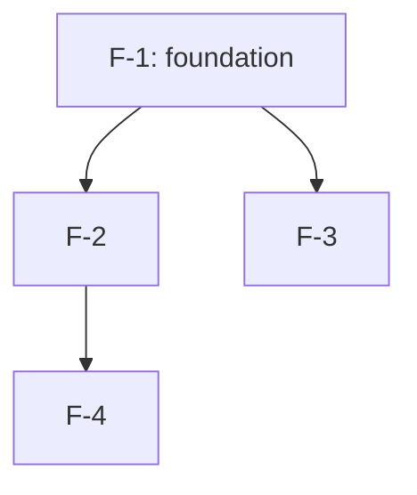

<!-- workflow-step: STEP-R6 | gate: GATE-0 | producer: ctx-aidlc-roadmap | condition: multi-feature prepared-requirement -->
# Feature Roadmap

Create this file at `aidlc-docs/_roadmap.md` (project level). Do not use it for single-feature work.

Prerequisite inputs:
- prepared-requirement source planning document
- `ctx/INDEX.md`, `ctx/project-profile.ctx.md`
- (brownfield) `aidlc-docs/reverse-engineering/*`

Related state files:
- `aidlc-docs/aidlc-state.md` (sync Roadmap State, Feature Index, Cross-Feature Dependencies)
- `aidlc-docs/audit.md` (Phase 0 STEP/GATE-0/HANDOFF events)

---

## 1. Source Document

- Source path:
- Classification: prepared-requirement
- Received date:
- Author (roadmap author):
- Depth Level: minimal / standard / comprehensive

## 2. Feature List

| Feature ID | Slug (kebab-case) | 1-line Responsibility | Type |
|------------|-------------------|------------------------|------|
| F-1        |                   |                        |      |
| F-2        |                   |                        |      |
| F-3        |                   |                        |      |

Type: `domain-feature` / `foundation-*` / `integration` / `ops/admin`

Rules:
- Slugs follow the naming rules in `skills/ctx-aidlc-run/SKILL.md` (kebab-case).
- Do not bundle two or more independent domains into a single feature (single-domain principle, `core/units-generation.md`).
- Place foundation features (common base) first as F-1.

## 3. Resource Matrix

Extract the resources each feature creates or modifies into a table. Mark ⚠ when the same resource appears in two or more features.

| Resource | Type | F-1 | F-2 | F-3 | ⚠ |
|----------|------|-----|-----|-----|---|
|          |      |     |     |     |   |

Type: `component` / `table` / `api` / `event` / `module` / `infra`

Resources marked ⚠ must be handled in the next STEP R4 (foundation extraction or single-owner feature assignment).

## 4. Dependency Graph

### 4-1. Inter-Feature Dependencies

| Source Feature | Depends On | Reason | Resolution |
|----------------|------------|--------|------------|
|                |            |        |            |

Resolution: `foundation-extracted` / `serialized` / `parallel-safe`

### 4-2. Circular Dependency Check

- Circular dependency: yes / no
- Resolution approach when found:

### 4-3. Diagram (optional)

If there are 5 or more features or the dependencies are complex, attach a Mermaid graph following `common/diagram-standards.md`.

```mermaid
graph TD
  F1[F-1: foundation] --> F2[F-2]
  F1 --> F3[F-3]
  F2 --> F4[F-4]
```

## 5. Allocation Recommendation

### 5-1. Execution Order

| Phase | Feature(s) | Execution Mode | Notes |
|-------|-----------|-----------|------|
| 1     |           | serial (prerequisite required) |      |
| 2     |           | parallel-capable        |      |
| 3     |           | serial (needs prior stage) |      |

### 5-2. Division of Labor Recommendation

| Feature | Recommended Owner (role/skill) | Notes |
|---------|----------------------|------|
| F-1     |                      |      |
| F-2     |                      |      |

The user fills in real owner names. This artifact only recommends by role/skill.

### 5-3. Parallel Safety Notes

- Specify if there are features that must modify the same module concurrently.
- Recommend serialization for segments with high merge-conflict risk.

## 6. Handoff Plan

Specify how each feature enters `ctx-aidlc-run` after Phase 0 ends.

| Feature | Input Excerpt Location | Classification | Depends On (artifacts) |
|---------|---------------|------|--------------------|
| F-1     |               | prepared-requirement | none |
| F-2     |               | prepared-requirement | F-1's `<artifact path>` |

- Input excerpt: the section range in the source planning document corresponding to that feature (e.g. "source §3.2 ~ §3.4").
- If the Depends On artifact does not exist yet, that feature waits until the prerequisite feature is completed.

## 7. Open Items

List unresolved items. If empty, "none".

- [ ]

## 8. GATE-0 Review Pointers

Key questions the user checks during the GATE-0 review (see the GATE-0 items in `common/stage-gate-rules.md`):
- Is the feature decomposition appropriate as responsibility units
- Are all ⚠ resources resolved
- Is there no circular dependency
- Does the division-of-labor recommendation distinguish parallel/serial
- Slug naming rule compliance
- Whether `aidlc-state.md` is synced
